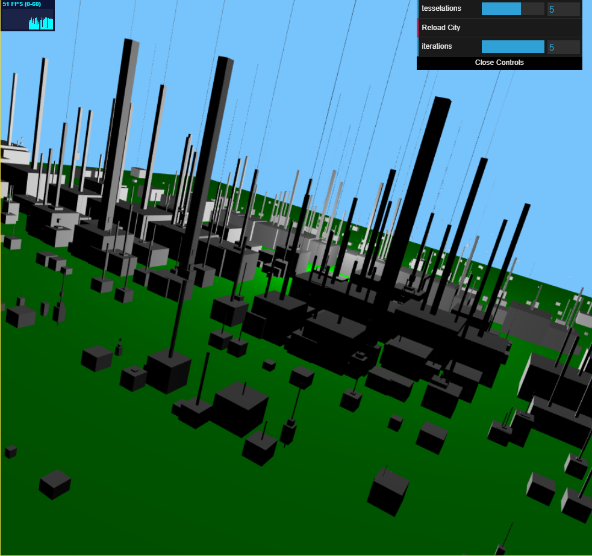

## READ-ME
For my city, I mostly went off the L System code I had written for HW4 and from projects made in CIS700 (Procedural Graphics) from last year.  For building placement, I generated random positons within the given plane and placed an initial shape in that location.  From that position, a single shape could expand to more complicated building shapes.  
I have a few different grammar rules that do some variations of similar actions.  Given a single cube, two cubes may be generated jutting out from its side (in the x or z direction).  Additionally, a cube may generate out from the top of the current cube.  For a longer rectangular cube, A regular sized cube may be generated at its top.  These simple rules build together to create more interesting and complicated building shapes.

